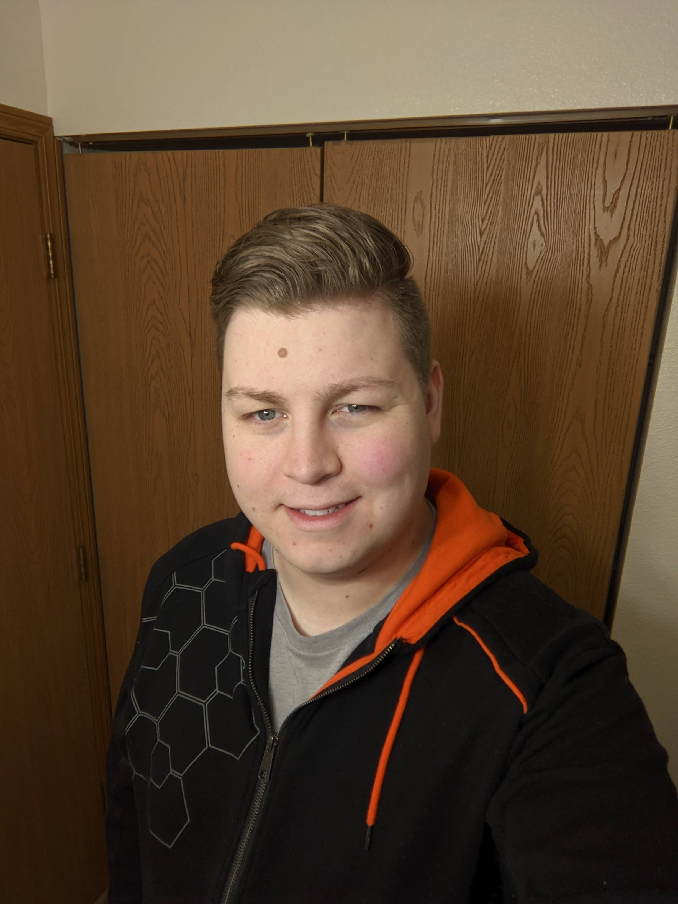
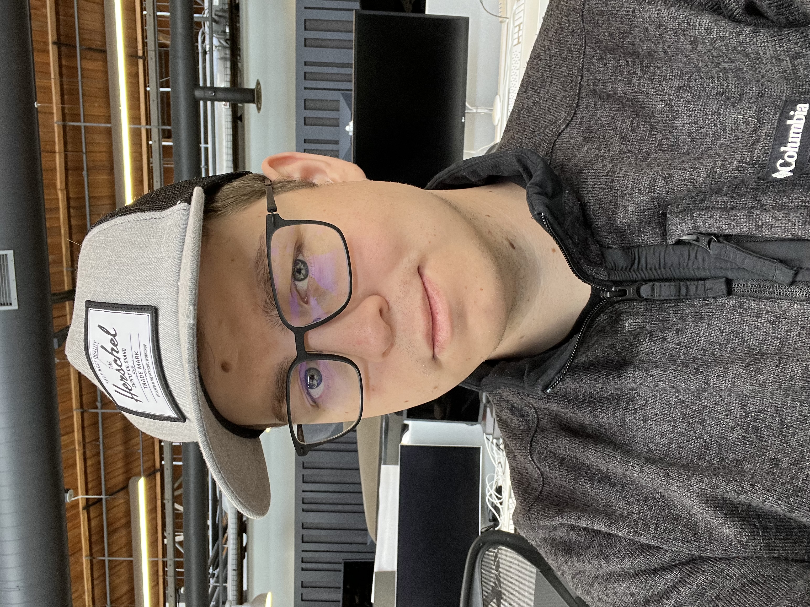
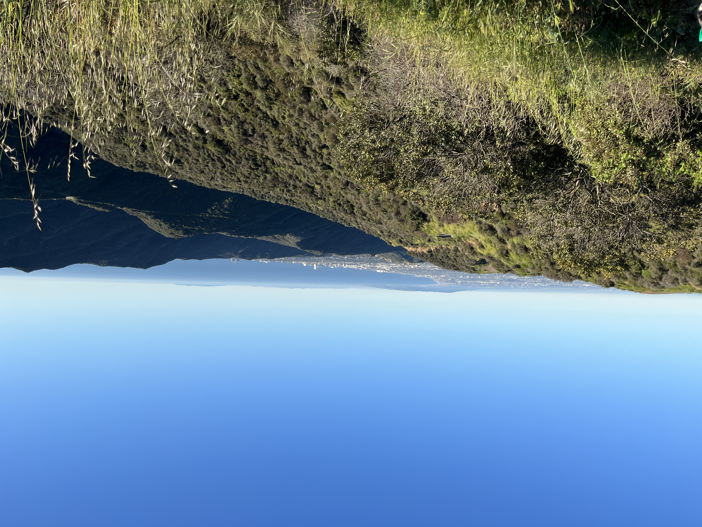

> This is the world we live in (Oh, oh, oh)
> And these are the hands we're given (Oh, oh, oh)
> Use them and let's start trying (Oh, oh, oh)
> To make it a place worth living in

- Genesis, *Land of Confusion*

Hello, internet sojourner! Welcome to my little corner of the internet.

To catch you up to date: In April of 2022, I had a massive panic attack and have been feeling the
aftershocks ever since. I have slowly adjusted to living with chronic anxiety since. 

## One year on...

My past year has been an interesting experiment into what happens when you suddenly cannot stand
anything about your life as it presently exists. Its amazing how fast it happened: food tasted like
ash, my once happy little countryside apartment (seriously, it was across the road from
a cornfield) transformed into an oppressive dungeon that I dreaded coming back to, as I inevitably
must each day.

Stuff that used to be fun ceased to be so. I had collected a little online circle of friends during
the pandemic and for a time, it seemed like enough. In fact, when the pandemic started in 2020,
I honestly kind of looked forward to the lockdown.

### A previous me

I've fundamentally changed as a person since early 2022. To be frank, I am deeply distrustful of
technology, and wonder if I can find a future away from it. With the advent of all the crazy new
tech this year, I fear that it may now be impossible. 

When I look back, my techno-skepticism began much earlier, probably around the time I gave up using
Google chrome in favor of firefox. I had read too much Cory Doctrow, too much EFF news releases...
or something.

To be fair, the "deal" we had struck with the big tech companies had also somehow been altered (to
shamelessly borrow from Star Wars), and I prayed it wouldn't be altered any further. I remember
when Google Chrome launched in 2008 (seriously, I used it from the first beta release, which
featured a [cute little comic from Scott
McCloud](https://www.google.com/googlebooks/chrome/index.html) and was offered as a humble
improvement and alternative to the outdated browsers of the time.

I also remember other moments of pure wonder delivered by new technology. The first iPhone was
a big one. I distinctly recall the rumors of its launch, and people saying it would have a glass
touchscreen, and I remember my reaction - I literally *couldn't believe* you could have
touch-sensitive glass. Of course even then touchscreens already existed; I simply could not
comprehend how they worked.

Unfortunate, that back then none of us could comprehend how smartphones in general would change
everything.

Now, I'm not going to go full nostalgia bomb. Clearly smartphones have made our lives better in
concrete ways. I also recognize the usefulness of browsers, search engines, and social media as
useful tools.

But I simply cannot look to emerging new technology with unfettered optimism now. I've seen too
much. And I have deep fear weighing on my bones about it. 

In my darker moments, I feel like we are at the final days of an experiment in progress that
started with the enlightenment half a millenium ago. Do I think humanity will be going extinct? No.
But I do suspect its about to get significantly less pleasant for the vast majority of us.

### LA Honeymoon

In the midst of all this fear, I followed a "geographic cure," as some call it, deciding to leave
my job in Holland, Michigan, to work for (let's be honest) one of the very companies I'm now so
scared of, in Los Angeles.

LA is, as most places are, a mixed bag. The weather (excepting the oddity of this February and
March) is pleasant. The scenery is gorgeous. I have already met wonderful people, and I even found
a church community that I've at last settled into in a way I never did during my 7 years in
Michigan.

The food options are incredible, and I've loved the freedom to just decide to go to a live improv
event and see fantastic artists ply their work.

But the traffic sucks. The "concrete jungle" is very real and I find myself pining for the wide
open green spaces that I had, just six months previous, felt so unnerved by. There is also the
pressure of a much more cosmopolitan and (on the surface) secular world I am now in.

Its honestly a good thing, I believe, that I am not in a societal bubble like the one I grew up in,
and maintained in Michigan. Its *good* that I daily interact with people who look different from
me, believe vastly different things about the world, how it works, where its going, and why its
here.

Its good that I see the large, visible homeless population and feel discomfort about it: the
challenge is to act in a positive way from this discomfort.

### Rearranging chairs on the Titanic

A core belief in my soul has emerged: that this priviledge I now enjoy is temporary. I will not
have this job, or this career, forever. The income I make, while actually below average for my
field in California, is still enough to live comfortably and, for now, give generously.

There is an impetus to be way more tight-fisted. The fear of the future informs me that I should be
saving every single excess cent; enjoying nothing beyond the essentials, giving nothing beyond what
is required.

Part of me, I think, gives so freely out of a silly hope that people will remember and return the
favor when things get bad for me in the future. That my largesse now is somehow writing a check of
goodwill I can cash in.

I therefore try to remind myself in these moments that I must expect nothing. I must give with the
expectation of no thanks, no rememberance. I must give wholly realizing I may never interact with
the person or organization ever again; and our exchange will be mutually forgotten.

What then remains? Why do I still feel a drive to share and give what I have? The impetus, freed
from the hope of a favor in the future, is pretty ugly:

**I give out of guilt.** I feel like all my life I have been blessed, or at least been lucky: I had
a supportive home with loving parents who had good jobs. I had a good social fabric in my church.
I was fortunate enough to become interested in a field that is very lucrative, and I have so far in
my short career of just under 4 years seen fantastic upward mobility.

### Guilt and Gratitude

I don't deserve any of this. In fact, I don't deserve each breath I take. It was given to me by
God, the Universe, Chance, what-have-you, and it was given without anything expected in return.

If I contemplate this, I sometimes find my negative guilt can transform into a positive gratitude.
The main thing about guilt is it reminds me of all those who do *not* have what I have. I feel bad
for it. When this feeling festers, it becomes a terrible thing, ironically causing me to close in
on myself more. I have so much I don't deserve, and I feel guilty, so I feel like I deserve to lose
it.

Gratitude is subtly different for me. I think gratitude, in my mind, works from an abundance
mindset, as opposed to a scarcity mindset of guilt. They both recognize my fundamental
undeservedness, but gratitude carries this further, all the way to the confusing truth that we
exist in the first place - and we didn't *have* to. 

## Anxiety

Can anxiety be a gift? Is it somehow changing, molding me? It certainly is a great source of
energy; I feel it dance over my skin like an electric charge seeking ground.

With this much energy, it *must* cause change. I cannot NOT move in some direction with all of it.
The default direction, I think, is one of shutting down, of pessimissm, of fatalism.

I'm searching, and from time to time finding, glimpses of a different impulse. Its not the default
at all. But the anxiety sometimes pushes me to a place where the beauty and tenderness of all of
*this* stuff, this existence, shines and sings in splendor.

I wonder why we are built in such a way that this is not our default. Perhaps this is that state of
sin, or even of hell, that the old religions sternly remind us of. Are we born on a path to misery
on purpose? 

Is this path set before us a cruel joke, a sad necessity? It touches on the problem of evil: why
would a God, if God were good, make this the default?

### Choice

I suppose my options are simple, as I can only make choices right here, right now: when faced with
evil, or dispair, or self-hatred, I can proceed forward with the stance that life is a burden,
a series of challenges to be endured.

Its hard to see, even now as I write this I can't really see it, but I know I've seen it in the
past, and I know others have: a second choice; a choice of life as a fundamentally good thing, an
unfolding story that's headed somewhere.

## The Future is Change

For now, the only thing I can hold with anything close to certainty is that the future will be
*very* different from today. And I know that humans, including myself, really, really, reeeealllly
don't like change. 

We complain about ennui, sure, but there is a core part of us that longs for certain safety in
perpetuity. I sure do. I believe, deep-down, that if I could stop things from changing, or roll
them back, it would be "better".

But that is an incomplete and rosy view of the past. Many things "back then" were much worse, and
we do a disservice to ourselves to forget that. And the seeds of hope, of things that may be better
in the future are by their nature nebulous and invisible today, still under the dirt.

\- Quentin

---

> “I wish it need not have happened in my time," said Frodo.
> "So do I," said Gandalf, "and so do all who live to see such times. But that is not for them to decide. All we have to decide is what to do with the time that is given us.”

- J.R.R Tolkien, *The Fellowship of the Ring*

