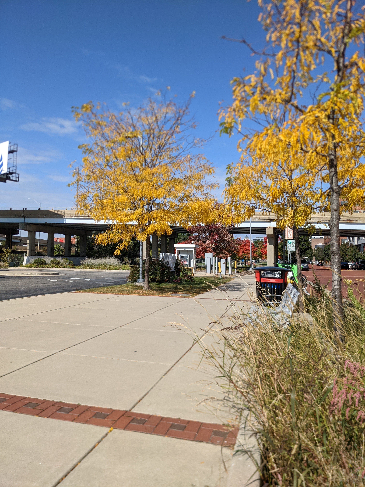
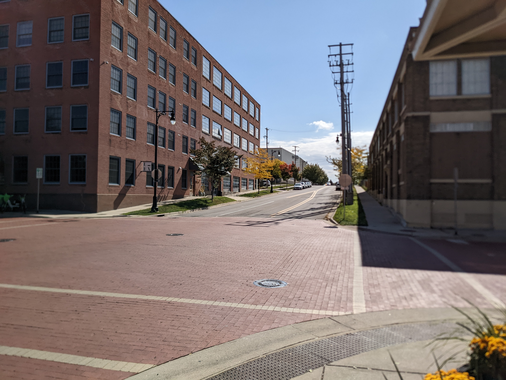
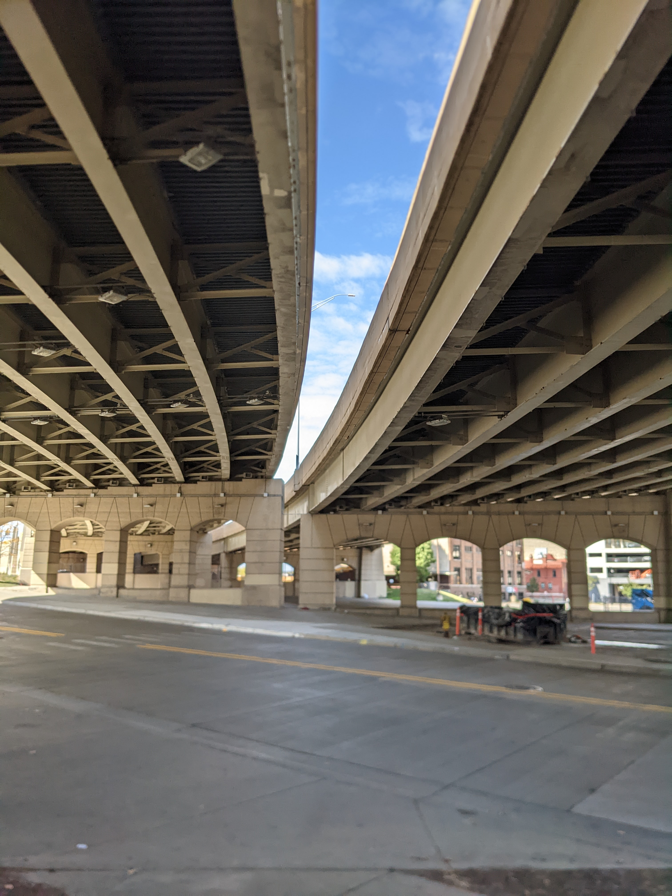

I'm still terrified of getting it wrong. Of my eyes opening to the reality of the universe after my last breath and realizing that I had chased what *I* wanted, and in doing so, rejected God.

It's so frustrating to come back to this fear, again and again, knowing that no matter which path I choose I can never perfectly content it.

So I cried aloud, "Lord even if you can't give me all the answers, give me one thing. One true bedrock on which I can experiment and fail and try but through it all at least know that one thing."

I then ended up going on a walk through the city and made my way, not by planning but just by following my feet, to a little coffee shop.

I ordered a small cup of a very lovely drink called a Miel, Sat down outside, opened up the book I'm currently enjoying, and begin to read. My reading was slow and disjointed, for some reason my attention kept pulling me away from the words in the page and demanded that I take in this otherwise normal Sunday in October.

I began to realize I was being pulled away because while it was just a Sunday in October, it was also anything but ordinary.

Today is an incredibly beautiful October day. The wind is brisk but not unpleasant, The sky a rich delicious blue, seemingly made bluer by the bite of the early fall chill.

If there's one thing I will miss about West Michigan, It's these colors. The yellows are so beautiful, so deep... I for a moment see them the way I imagine Van Gogh did, and I understand why he was driven to paint yellow in nature so much.

I love the trees that display a gradient of green to beautiful rich red. It's a specific pallet that somehow covers the entire spectrum, and balances it so tastefully.

I was looking up the street from this cafe at the trees lining the road, The Sun perfectly offsetting the breeze, The delicious sweet honey offsetting the chiding bitterness of the coffee underneath, and it all rose to a head and struck me across the skull like a blow from a lead pipe:

God was here. Right now. He was present. And it was all so obvious, I had to laugh out loud.

God's bedrock gift to me is his beauty and his love. Everything that I come to understand as true almost always rings true because it is filtered through love and beauty.

Not the sort of beauty that you might see trending on your social media, a kind of curated and artificially too perfect, too straight, too blemish free beauty.

This is the kind of beauty that ages into more beauty and more love. It is the kind of beauty that tastes so sweet not just in spite of, but somehow because of the fact that the world keeps moving, and things die.

It is the beauty that wraps the sorrow in tender loving arms, an offsets it the way the Sun offsets the breeze and the honey offsets my bitter coffee.

It's the paradox. It's the both-and.

It does not define itself by what it isn't, what it excludes. Because this kind of beauty can't exist in exclusion. This is the kind of beauty that grabs more and more of your focus, that pulls in more and more of the world, until it is all you can see.

Truly this is the kind of love and beauty that could make a suffering St Paul rejoice in the Lord, Even while in chains, Even while knowing that his life was forfeit to the Roman emperor.

He wasn't rejoicing in spite of his pains. He was rejoicing because for some reason at that moment God gave him a window to see the beauty of it all. And the beauty of it all included all of him all of his situation; all of his failings all of the fallen world all of the confused and angry and power-hungry.

It is the sort of emotional experience that cannot be described in a single word, I believe it is the same core experience that would cause one of the profits of the Lord to declare that Justice rolls like a river down over the nations.

It starts at the everyday. At the aching heart that pushes you from your chair and out the door searching for something bigger than you. And it keeps growing.

It germinates underground, in the dark, invisible to everything and everyone until it's ready to come forth into the sun.

I've been given so much. God has seen not just my actions but my every thought, and he's still allows me to sit in the midst of this incredible creation that is so much, in fact too much, for us to see and understand constantly in this way.

My God. Thank you.

