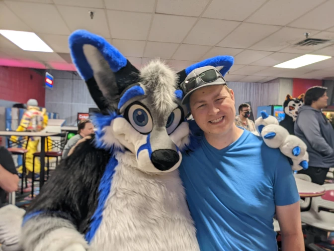

I have continued my journey, and I wanted to give a bit of an update.

Things still feel like I walk in two worlds -- maybe that's my current "theme". I like themes.

I picked a few "annual themes" [as suggested by CGP Grey](https://www.youtube.com/watch?v=NVGuFdX5guE) this year, and they were the following:

* Personal Health
* Moderation
* Variety

I thought I'd check in on what those themes have led me to.

### Personal Health
In July 2021, I weighed in at 308 lbs according to my doctors notes. Currently, I'm in the ballpark of 230. That's a pretty nice move, and I have seen its affects personally.

Its only since about July that *other* people have also noticed, and its generally people I haven't seen in quite a bit of time: moral of the story -- take a look at your old photos. You may not notice yourself, but change is possible, and it does happen!

I have walked this path by focusing first on diet, and then on exercise. I'm not doing anything particularly impressive for diet currently, and I think it has caused my weight loss to slow. But I now know I can do it, and I'm perfectly happy taking a bit longer, as long as it continues to progress.

Its helped my self-esteem quite a bit; I now suspect I'm at least a *little* handsome. We will see...

### Moderation
Tough one to nail down. I actually think of everything this is the most "mixed bag". I was thrust into a deep period of inner turmoil this year, starting in April. 

I think I'm mostly through it... but it started as a result of several very long days when I got myself involved in reddit's r/place project. I think the lack of sleep, the emotional high of working on an (admittedly very silly) big team project followed by a crash (my sleep schedule did not fare well for those three or four days) caused me to have a personal moment of "what am I doing!?" that forced to the surface some big questions I had quite effectively buried for a few years; questions all revolving around my sexuality and my faith. Those deserve there own dedicated post, and I have hope that my mental fortitude will continue improving to a point where I can honestly and frankly discuss them sooner than later.

### Variety
Well, the mental health crises was actually a pretty good kick in the shorts for this one. I'm reading a lot again for the first time in a good long while. I am reading both for fun (Terry Pratchett's *Discworld* series, Jim Butcher's *Dresden Files*, and I hope to start the insane list comprised of Brandon Sanderson's work before the end of the year), and for... less fun (Seneca, Nietzsche, Kierkegaard, The Bible, Richard Rohr, Rob Bell, John Piper, etc. A lot of philosophy, history, and theology).

I think my life in general is more varied, too. I visit more places, I live in a more interesting place, and I am purposefully taking the "leap" of reaching out and connecting with groups of people with shared interests. This included a very interesting day in Detroit, bowling with a group of Furries.

---

I have been listening to a lot of different stuff, too. I recently was listening to a religious podcast, and the guest talked about the importance of cultivating a sense of Christ's "interestingness". I am praying for a few things (including the very basic prayer of 'Lord Christ, teach me *what* to pray for') but I think I will add to my list this, "Lord, help me to find the Christ *interesting* again."

We will see. Thankfully, I am at a place where I can finally take a bit of a breath and stand up to honestly and without fear consider some of these important questions.

We make terrible judgments when fearful, tired, or anxious, and I believe that if God is just and Loving, he will help us find a path to him that is genuinely a result of interest, excitement, and love, and not mere fear. Fear can be part of the journey, even a fear of God, but it is no basis for a healthy, thriving relationship. I think that is something missed by the people who show up to Pride parades with signs declaring the imminent damnation of the participants.
