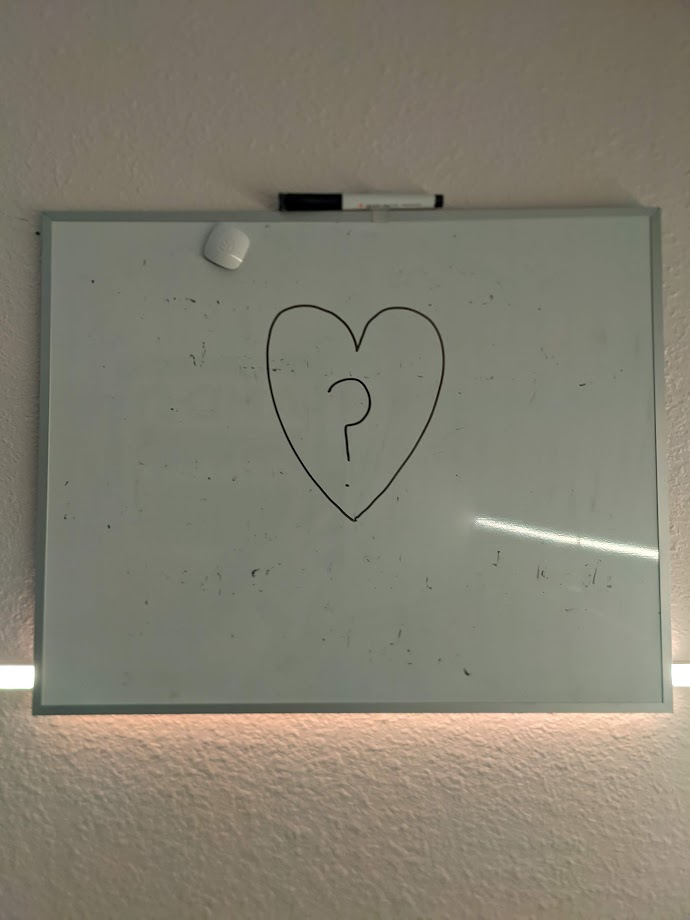
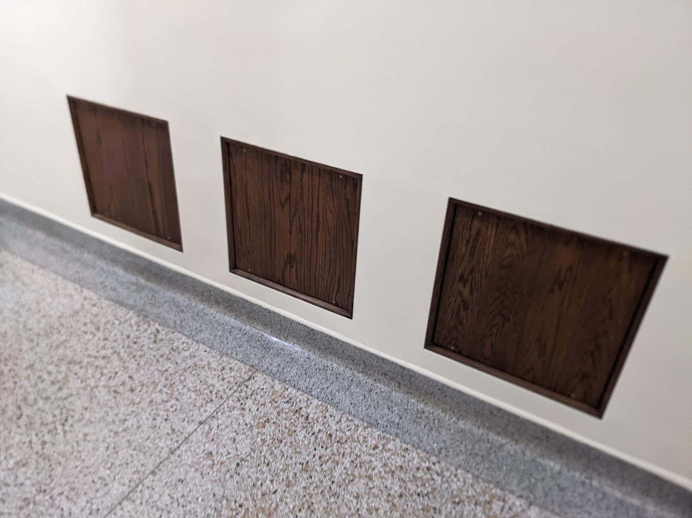

## Or: Diving Beneath Language and Pulling it Back Up

I feel a strong sense of meaning and fulfillment when I can communicate an Idea I genuinely believe in to an audience. Probably the strongest moment of that was my high school graduation, speaking to an audience of 500 classmates and thousands of friends and family in an arena. More recently, I have been showered with wordly blessings. I have a great job doing interesting things and with wonderful people.

And on April 5, 2022, I became acutely aware that I am going to die someday, and none of it mattered at all to me any more.

I tried my usual ways of getting absolution, I wrote Bible verses (Galations) on my whiteboard and read Max Lucado books. I feel into a deep nihilism, and the Bible quote turned to Neitschze.

In early June, I erased my whiteboard and simply wrote a question mark. And for some reason I drew a heart around it, and that's what has remained since.

I had my college roommates over for a Saturday evening, we played games and drank and joked about one of them and his upcoming wedding. The betrothed left early (long drive home) and the remaining friend and I wandered outside and started talking about whatever.

And we kept talking until nearly midnight, 4 hours of back and forth.

His central question mirrored mine: by all likelihood, we are destined to lead medicore lives. He was stating it as a fact. And he was afraid that he would become *okay with it.* I wish I could have given him some of the weird, beyond-words ideas that had been percolating in my head for months at this point, but I could only halfheartedly ramble on and on, trying to explain but failing.

I want to communicate things that I have found to be deeply true, but the ideas and feelings and concepts I'm beginning to ponder are refusing to yield to language, because at some level they are too big. Rationality has failed me. It began its death in 2016, I think, and I buried it this June. I wouldn't say I've run to *ir*rationality (or at least, I've tricked myself into thinking I haven't)... rather, some sort of trans-rationality. I'm walking what Robert Persig calls "the high country of the mind", and I'm getting a headache because I haven't acclimated to it.

I'm so alone right now. The few people that I feel understand, or at least tolerate, my thinking have limited time and I feel I can only go to them so often before they too get fed up and really lock me out. I desperately wish I could know who was safe to talk to, I need a shibboleth, a secret signal, to identify them.

My church has become alien, hard, and alarmingly cold. I desperately need my God, but the thought of entering his house makes me feel uncomfortable, even physically ill. I love the people of my home church, but will they still love me?

I walked through downtown after work for two hours today, reading and pondering. The church on Hope's campus was open, and I walked inside, looking for god. The main sanctuary was dark and empty, and I did not find God there. I walked into a small room below, and saw three nondescript wood panels in a wall. Was this where the church kept God? I said this tongue-in-cheek, of course: I don't really believe the trinity is stored behind three wooden panels in a church basement in West Michigan, but for a moment I genuinely wished it were so.

I wrote in my journal earlier in the walk, thinking about wind and air.

> On a clear summer day, you cannot see the wind at all. When I think of my mental connections to wind, I see an old painting of an anthropomorphized cloud, lips pursed, blowing.
>
> In the paintings there's always these wavy lines and white or gray substance to show us the wind.
>
> But as I look at the trees right now, you cannot see anything affecting them. You only see the wind in the bending and thrashing of the leaves and branches.
>
> You also feel the wind, and you hear it. But you cannot see it at all.

On one level: *duh*. But Seriously, try and look **at** wind, or air, on a clear warm day. Not the shimmer of heat, or the movement of leaves, or clouds--look at the AIR ITSELF.

God feels like that to me right now. She's everywhere, They permeate existence and are as nessessary to us as the air we breath. But you cannot directly look at Him. Maybe, in the same way that if air was opaque we would not be able to see anything else, God has hidden from us on a material level because it would overpower our senses otherwise.

This is what I'm starting to believe about meaning -- in the grand sense. Trying to take in a grand universal understanding of meaning would be like trying to hug a semi truck barreling down on you. The way I see it, we can think just enough to be dangerous to ourselves. Life has no meaning in so far as there is no meaning that is understandable to the fucking 2 HP putt-putt engine we have to traverse a highway called metaphysics.

Picasso used to carry a revolver loaded with blanks that he'd fire at people who ask him what his work meant. God carries a handful of neuroses and existential dread that he wads up into spitballs and fires into the ears of philosophers that get too big for their britches.

So WHAT NOW? How do I comfort my friend, afraid of a "normal" life. How do I convince him, and in a deeper way, myself, that this delicious moment of our consciousness is not some generally beige-colored march to the grave that we occasionally dip below into depression or jump above into happiness? I crave a concrete platform to build on, because I am all too aware now that my house was built upon the sand, as Jesus warned.

The CRC seemed to impart a sense of certainty. But the results of that certainty: predestination, limited atonement, and the declaration of same-sex relations as an abomination now elevated to confessional status, I find this certainty to be an incarnation of hell itself to me. If I continue to dwell in it, I genuinely feel like I'm in torment. It provokes a physical reaction.

Who do I go to?
What now?
When will I feel normal, and be able to just live life again?
Where are my words?
*Why* is this so confusing!?

How do I continue?
