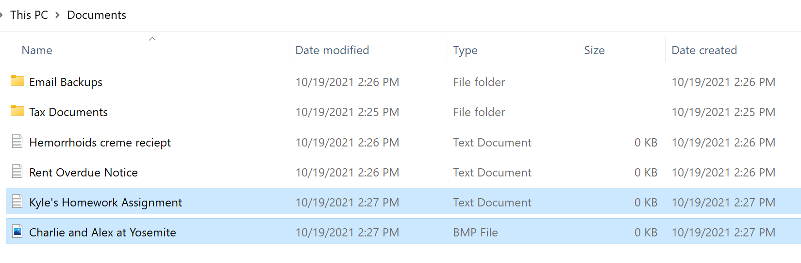

## Money Traps
At the heart of the popular cloud solutions is that they are *free*. Well, free at first (we will get into that later).

There is a now oft-quoted statement first popularized by security expert Bruch Schneier. In 2010, [he quite presciently said at a security conference](https://www.information-age.com/facebook-is-deliberately-killing-privacy-says-schneier-1290603/), "Don’t make the mistake of thinking you’re Facebook’s customer, you’re not – you’re the product. Its customers are the advertisers."

While I admit this has been overused and abused, it sticks because for a lot of free internet offerings, its right. Cloud is a bit of a conundrum for this model, though. While social media may have slipped the wool over the eyes of society and somehow convinced the majority of the public that its somehow okay, even normal to just give away all your info for free in a social context, people are at least suspicious of the technique when applied to their hard drive contents.

I mean, even if you don't immediately think of some embarrassing document, are you 100% certain that there *isn't* a textfile buried 5 folders deep somewhere containing your [middle school love poetry](https://xkcd.com/1360/)?

You good with Google selling you ads based on that?

Here are the privacy ratings of the Terms of Service for Google, Dropbox, and iCloud, courtesy of the [ToS;DR Project](https://tosdr.org/en/about) (Click on the badges for the full breakdowns):

Some of the highlights:

* iCloud (Apple), Microsoft and Google reserve the right to delete any of your data, with *no notice*, and for *no reason*.
* All of these providers track your location and other "metadata", and share it with third parties.

## Meta-

Metadata, by the way, is a really weird term that has a lot of baggage. In short, its "data about the data": how big the file is, when it was created and last modified, the type of file, the *name* of the file... Basically, think about the data you see when looking in your "My Documents" folder -- everything except the file preview would be considered metadata. Here's a fabricated example; do you feel like the owner of this data would be okay with arbitrary "third parties" seeing it?

But that isn't enough. Since, as far as I know, all major cloud providers are for-profit companies, they are compelled to increase both the amount of users, and the amount of value extracted from each user. That means in addition to the unsavory data brokering, cloud providers have taken a page out of the drug dealer's playbook: offer a taste of free cloud storage as a loss-leader. Once you've gotten the handy synchronization set up, files gradually accumulate until the quota is hit sometime down the line, and then you get hit with the desktop pop-ups, emails, etc. warning you that *you are in danger*, your precious files won't be synced unless you pay us to upgrade!

And at that point, with 5+ GB of data synced and the cloud provider deeply ingrained into your workflow... what the heck, throw them a few bucks. You're all set now, with up to 2 Terabytes of data storage! Woohoo!

But, gosh, if we are all going to be sucked into paying for data storage, why are we okay with providers "double-dipping"? At that point, I would recommend looking at a provider that doesn't play the freemium, ad-supported games: find a provider that charges *up-front, right away*.

If you are technically inclined, I cannot reccomend [rclone](https://rclone.org/) enough. This command line program (with a [GUI](https://rclone.org/gui/) in the works!) can map to pretty much any cloud provider as a front end. That means that if you want triple-redundant storage between your personal devices, an enterprise-class data host like AWS, and a consumer cloud product like Google Drive, you can. Even better: you don't have to trust your data or metadata to these hosts, because you can configure rclone to [encrypt](https://rclone.org/crypt/) the data before upload; it will be transparently decrypted by rclone on retrieval if or when you ever need it. 

In this case, you could even look at using a public cloud provider -- all they would see is a bunch of random binary blobs -- but I'd still caution against it because providers like Google have been known to flex their "we can delete your data at any time for any reason muscles" and nuke binary blobs (ostensibly for "anti-piracy" reasons, as they argue "if a customer is hiding their data from us, that *must* mean its illegal, right?").

---
## How to Do it

My personal setup for keeping all of my files across all my devices synced and backed up is this:

1. Each device I have data I want saved is running an instance of Syncthing (see my [last post](/posts/personal-cloud/) for more), usually the "My Documents", "My Pictures", etc folders (or Mac/Linux Equivalents)
2. One of the syncthing nodes in my replication network is on my home "server" (basically a low-end PC with extra hard drives). I have a very small script that I wrote that uploads an encrypted copy of all this syncthing data to [Backblaze](https://www.backblaze.com/) on a weekly basis.

There is no step three. I have between 100 and 200 GB on Backblaze pretty consistently, and my average cost is 50-60¢ per month. Yes, *cents*.

I understand that I glossed over a lot of things here; one does not simply "write an rclone script" and attach it to a cron job without previous working knowledge of linux. Luckily, you don't need to use linux, or have a dedicated server, for that matter. All you need is a primary computer that is regularly connected to the internet.

Here is the steps I'd go through for doing it on Windows, assuming I'm running Syncthing on it already:

1. Download rclone for windows
1. Configure an rclone [backend](https://rclone.org/overview/), e.g. [Backblaze](https://rclone.org/b2/)
1. If I haven't already, I change the folder and file options in windows to [show file extensions](https://www.howtogeek.com/205086/beginner-how-to-make-windows-show-file-extensions/) (I always turn this on when I set up Windows, anyways)
1. Open up the Windows Explorer to my User folder (These days its easiest to go to "This PC" and click the up arrow next to the navbar)
1. Right click, Select `New > Text File`
1. Put in a basic rclone `sync` command, something like `rclone sync C:\Users\MyUser\Documents Cloud:`
1. Save the file as `rclone_sync.cmd`
1. Make an entry in [Windows Scheduler](https://thegeekpage.com/how-to-create-advanced-tasks-in-task-scheduler-for-windows-10/) to run that command on a regular basis

This, I admit, is still pretty technical, but it is at least approachable for a Windows user. If you absolutely don't want to deal with your own configuration, which I totally understand, then at least use a *paid-up-front* provider, none of the freemium nonsense. Backblaze, who I use with my manual config, offers an [easy solution](https://www.backblaze.com/cloud-backup.html) with **unlimited** storage for $7 a month (not a sponsor, btw). Its more than pocket change, but you can just use a GUI and forget about it. And they aren't the only option. They primarily focus on small business customers, but [crashplan](https://www.crashplan.com/en-us/pricing/) will happily offer you backup services for $10 a month -- my work uses them and I've found it a pretty nice setup.

If you look at the privacy policy of paid providers, you may see some scary boilerplate. I must at this point argue for a bit of realpolitik and concede that as long as you are putting data in the "cloud", its going to be on someone else's computer and they will have data about you (your payment info, the IP you are uploading from). If this is an absolute no-no, then these posts aren't for you and you should look at offsite data storage solutions, where you physically hand a briefcase of HDDs to a company that stores them somewhere secure (its not unheard of for these places to use caves or disused mines). One of my first jobs as an IT technician included me going to the security team, picking up a locked hard-sided briefcase, and delivering it to a storage provider; with chain-of-custody paperwork and everything.

But that is a bit off-topic. My high-level suggestions, in order of what you should consider, are:

1. Use a tool like rclone to automatically encrypt and upload your data to a cloud provider.
1. If you don't want to deal with that, use a *paid* backup tool.
1. Try to use open-source offerings whenever practical.

Best of luck,

Quentin
