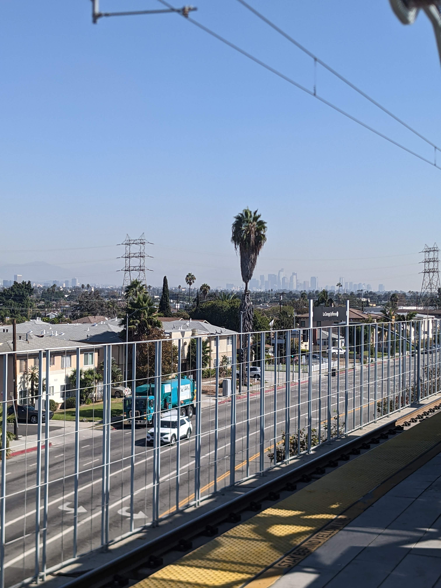
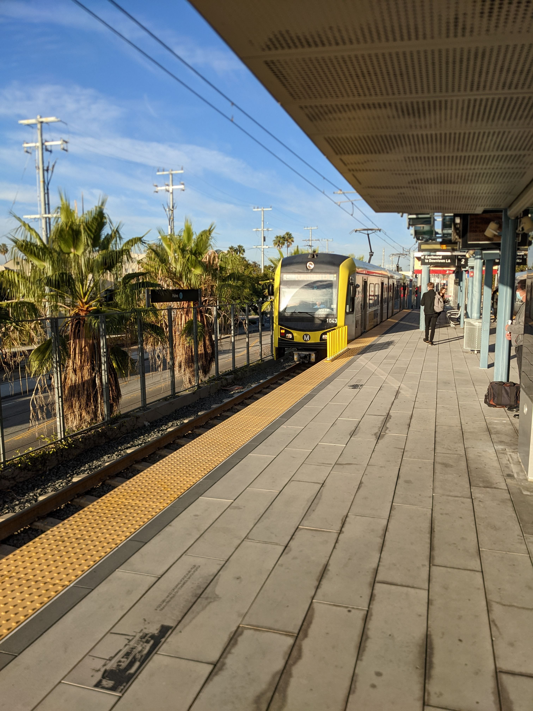
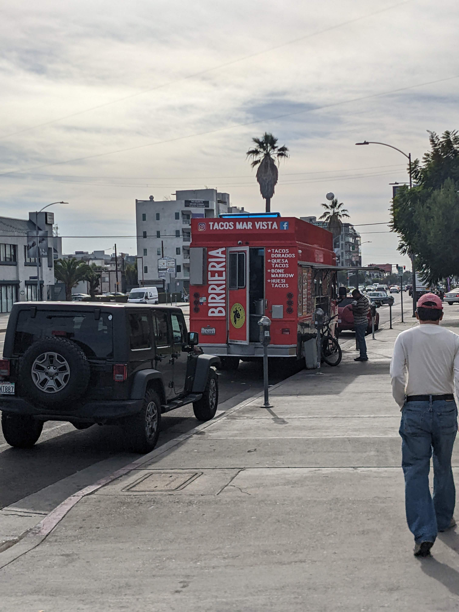
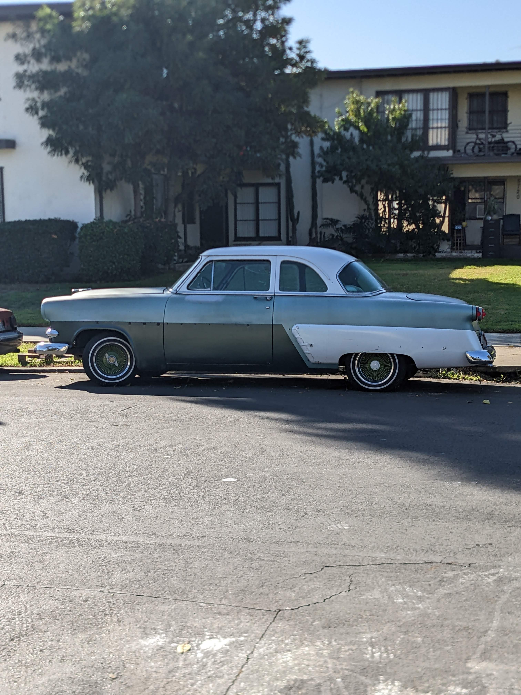
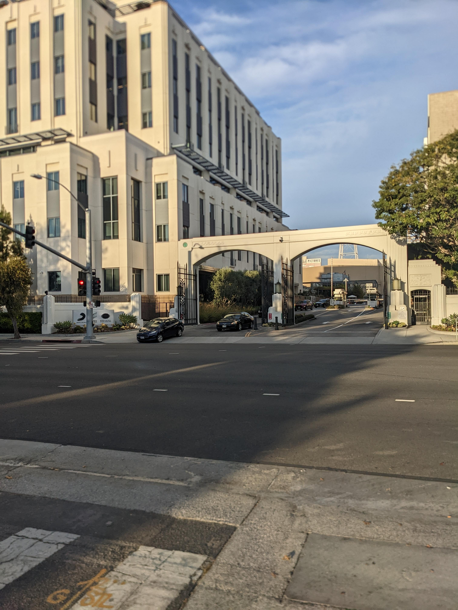
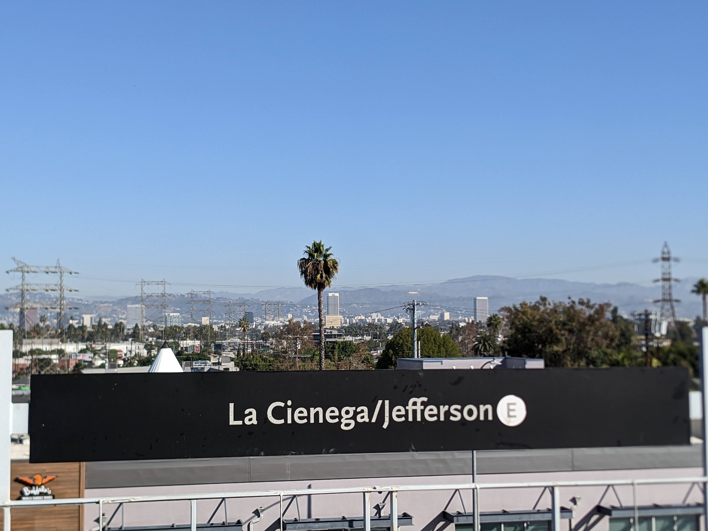
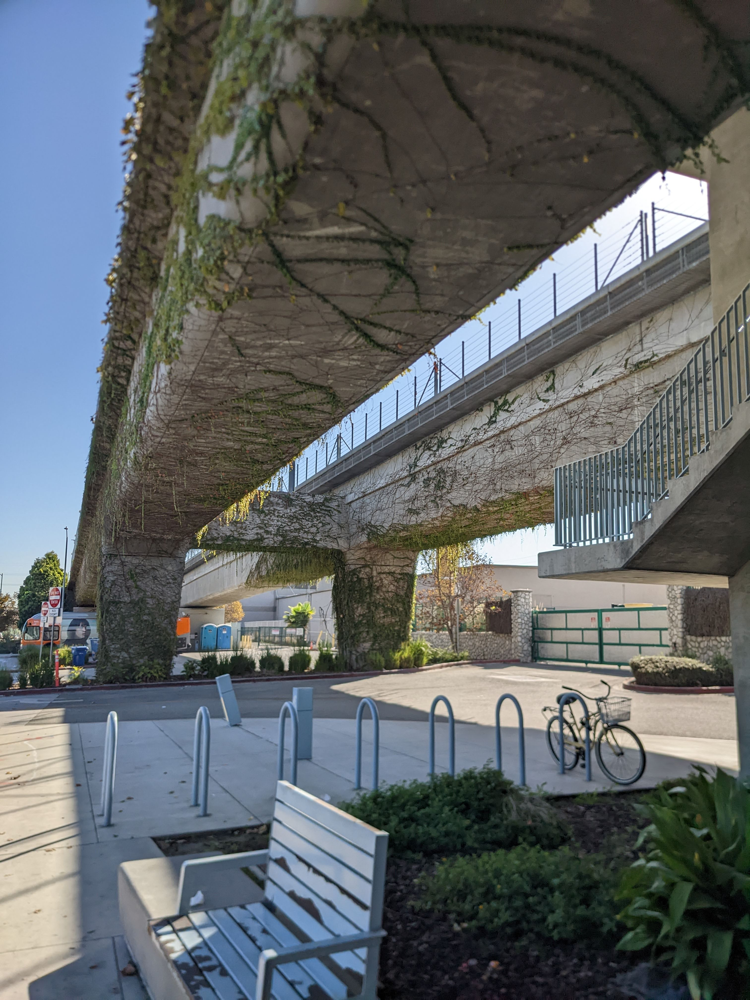

> *Cause you belong to the city*  
> *You belong to the night*  
> *Living in a river of darkness*  
> *Beneath the neon light*  
> *You were born in the city*  
> *Concrete under your feet*  
> *It's in your moves*  
> *It's in your blood*  
> *You're a man of the street*

  

Yeah... I'm in a bit of a honeymoon phase with Los Angeles. Its a really cool place!

  

Its easy to hate the traffic, but its possible to skip a lot of it. It doesn't come easy, but if you take some time to select housing near one of the metro lines, it is absolutely
possible to go without a car... most of the time. This isn't going to be a San Fransisco or NYC situation - sometimes you *will* need a car. I'm okay with only needing it 1-2 times
a week, though. 

I've been enjoying following my feet and finding interesting places. In Culver City, at least, its safe, fairly pleasant, and there are some neat discoveries! For me, that includes taco trucks.
  

Its interesting how LA is really about 6-8 (depending on what you count as "LA") smaller cities that are genuinely their own distinct places. This means you will be walking in a downtown area,
and you will cross a street, turn a corner and find yourself in a little suburbian neighborhood. Mind you, all the houses are 7 figures, but its quite an experience nonetheless.
  

I also can sense the quiet but firm presence of the city's entertainment industry. 

Its not easy to forget that the modern capital of pop culture is here. The metro station by my office, for instance,
gives me an unobstructed view of the Hollywood sign.

This is not heaven, of course. There is a lot of grime and haze, everything is *expensive*, and its clear that there is a tension in the lower and middle classes. The people experiencing homelessness
remind you of their existance - and it is good for us to remember that but for the grace of God, we may go as well.

LA offers wonderful weather, exposure to so many different wonderful people, amazing food, a lifetime of cultural experiences. It also offers the withered lawns, astroturf and xeriscapes as a testament
to the ongoing drought. For now the skies are clear of smoke, but wildfires are basically a given; not a matter of if, but when.

Still, though I realistically shouldn't, and though many would find this place oppressive, stifling, disgusting... I really do find myself falling in love with it. 

I hope the feeling lingers.

