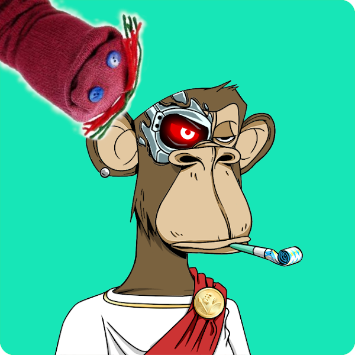

*(Ape #727 owned by darylmorey on OpenSea. Sockpuppet picture by Rion, CC BY 3.0 <https://creativecommons.org/licenses/by/3.0>, via Wikimedia Commons)*

## Am I out of Touch?

Recently a [short essay](https://networked.substack.com/p/web3-i-have-my-daots) by Jay Pinho on the "networked" substack[^1] caught my attention.

The post isn't too long and you should give it a read. It raised a point that made me sit back and think, and it was this simple question:

* What if we ('we' being Web3 skeptics) are like the skeptics of the Internet in the 90s?

The post started with a really funny-in-hindsight excerpt from an interview Bill Gates gave on the David Letterman show, where Bill is trying to explain the cool things the internet can provide (listen to a baseball game whenever you want), and David is in turn throwing out these counterpoints (radio and tape recorders) that make the internet seem crazy overbuilt to solve problems already solved.

The point being, of course: "No one wants to sound like David Letterman."

To Pinho's credit, he continues on from there to carefully point out several problems with Web3 and ultimately delivers a sound rebuke of the current state of it, but he still leaves his David Letterman cold open sort of lingering in the air.

He brushes up really, really close to a historic counter-punch to the fear of being an out-of-touch naysayer, but doesn't quite complete it.

## Pets.com

[From Wikipedia, the free encyclopedia](https://en.wikipedia.org/wiki/Pets.com):

> Pets.com was a dot-com enterprise headquartered in San Francisco that sold pet supplies to retail customers. A high-profile marketing campaign gave it a widely recognized public presence, including an appearance in the 1999 Macy's Thanksgiving Day Parade and an advertisement in the 2000 Super Bowl. Its popular sock puppet advertising mascot was interviewed by People magazine and appeared on Good Morning America.

The pets.com idea was simple: take the pet store, combine it with this newfangled internet, add a little techno-wizardry, and Presto! Everyone involved gets filthy, stinking rich.

Pets.com was an apparent darling from its conception in November 1998. Amazon purchased a majority stake in the company, which went on to get 10s of millions in venture funding. It went public February 2000, raising almost 100 million (not a lot now, but a big deal then) and was listed on the Nasdaq under the ticker IPET.

Everyone was talking about the company. Pets.com began a media blitz, recruiting [celebrities](https://twitter.com/ParisHilton/status/1366588422643585027), running a Super Bowl ad, and popularizing its quirky, [animalesque mascot](https://www.newyorker.com/culture/infinite-scroll/why-bored-ape-avatars-are-taking-over-twitter).

Oh, I should mention that I removed a sentence from the Wikipedia summary. Here it is, unedited:

>Pets.com was a dot-com enterprise headquartered in San Francisco that sold pet supplies to retail customers. **It began operations in November 1998 and liquidated in November 2000.** A high-profile marketing campaign gave it a widely recognized public presence, including an appearance in the 1999 Macy's Thanksgiving Day Parade and an advertisement in the 2000 Super Bowl. Its popular sock puppet advertising mascot was interviewed by People magazine and appeared on Good Morning America.

Pets.com lasted 2 years, ultimately burning money via mismanagement and getting killed outright when the dot-com bubble burst.

## Chewy.com

Now, the pets.com idea itself wasn't entirely smoke-and-mirrors. It had a good core. And eventually, once tech matured a bit more, things settled down, and people came into the space with a longer-term, nuanced understanding of the internet, a spiritual successor arose in the form of [Chewy.com](https://chewy.com).

Incidentally, when they went public in 2019; they ended up raising 10x what pets.com managed 19 years previously. Today, they're worth over 7 billion, and seem to be here to stay.[^2]

---

## My Point Being...

It isn't a perfect analogy, but I'd respond to anyone trying to push the "[David Letterman against the Internet](https://youtu.be/gipL_CEw-fk)" defense of Web3 with the "[sock puppet dotcom-dog](https://www.youtube.com/watch?v=sICSyC9u5iI)" attack.

Here's a breakdown of why I think Web3 maps on to the dotcom bubble:

1. Its based on a novel technology breakthrough that *is* important and *will* stick around, but
2. most high-profile examples in the space aren't doing anything special outside of `old thing` + `BLOCKCHAIN` so they can
3. make a [shitload of money](https://www.youtube.com/watch?v=km0_vOE_2XE).

I think that the idea of a Blockchain -- a distributed merkel tree, with inherent incentives to make untrusted parties work together according to a set of rules, is a fascinating idea and it will probably go into some very powerful, dynamic-shifting companies, frameworks, even _movements_. But first, it may need to have its own dotcom bubble to burn off the chaff.

[^1]: Of *course* it was on substack. (And yes, those grapes probably *are* sour!)
[^2]: Disclosure: I own a modest amount (<$200) of CHWY stock.
