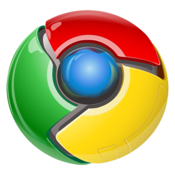

I used to be a huge fan of Google's product offering. I started using Google Chrome around version 2, in 2009 -- before
it had added support for extensions, themes, or syncing between devices through your Google Account. It wasn't a
juggernaught on the verge of becoming *the* internet browser; instead it was introduced via a cute [interactive digital
comic book](https://www.google.com/googlebooks/chrome/index.html), had bright blue colors and an icon that imparted a sense of futuristic alien tech, as if it had fallen from
the sky into the office of a bunch of Google hackers, who gifted it to the world.

 

Around the same time, my sisters migrated off their MySpace accounts, following their friends to a hot new site that had
finally opened the doors to non-college students called "Facebook".

I remember when google launched this crazy idea of a word processor that you could use inside a browser. I remember
excitedly looking for an excuse to upload and share stuff on Google Drive, sure that it was an interesting experiement
that would fade fast.

My close friend in high school got accepted into a crazy beta where Google was handing out [free
laptops](https://en.wikipedia.org/wiki/Chromebook#Cr-48) and merely asking for feedback in return. He showed it running this
exciting new Linux-based OS that Google was working on. 

---

It is hard to pinpoint the moment Facebook went from curious to creepy; Google from serendipitous to impersonal and
monolithic. I wish I could look back and see the last time I had used Google Chrome as my browser, but I know its been a
couple years.

Something changed. If I as a user were a frog, I guess I finally decided the water is too hot. But now, stepping out of
these massive ecosystems is proving to be much harder than it was diving in.

## Winning Back your Data

The modern privacy landscape is a *wreck*. This is not exactly a controversial statement. In fact, I'd wager the general
response to that sentence is not disagreement, but a tired shrug. Yeah, Facebook, Google et. al. own our lives -- that
is just the choice we made as a society in exhange for all the cool free stuff, including:

* Spam emails from "Nigerian Princes"
* The latest hoaxes, fresh off the press and on top of our feed thanks to Carol, that one girl we kinda knew well enough
  in high school that we begrudingly accepted her friend request
* Shockingly accurate ads... for the slippers we already bought yesterday

You may get the impression that I feel we got a raw deal. Cards on the table: yes, I think we did. The internet
advertising behemouth is a result of us taking a micraculously transformative technology that can deliver any
information from anywhere to anyone at the speed of light, kludging a quick solution to make it work for modern
captialism, and then refusing to move on from the kludge.

I do think that the era of advertising-funded free services is approaching a fork in the road, where it will either
effectively end for anything but the most trivial of services, or morph into something even darker. 

## Fighting the Fatigue

Be it Climate Change, Polarization of Society, or Electronic Privacy, it is easy to get decision fatigue and give up.
Sure, there are many, many ways to opt out of the circus; lots of weird geeks on the internet have produced guides on
how to do so that are simutaneously uncomfortably complex and yet full of unaddressed questions or assumed knowledge.

I don't blame the average user for not wanting to wade into it. 

If we want to change the direction things are headed, it requires more than individual action. We ultimately may need
the State to step in and fix things, and that opens up a big can of worms that is out of scope for this essay.

Right here, right now, I'm talking to *you*, dear reader. As in, you, the person reading this.
